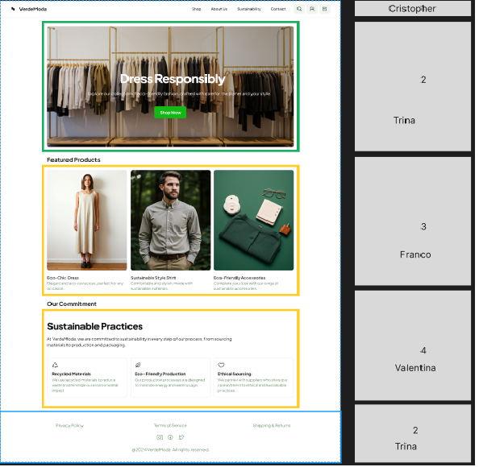

# 💚 Proyecto "Dress Responsibly"

Este proyecto fue desarrollado a partir de un diseño proporcionado en Figma. El equipo dividió la maqueta en cuatro secciones, asignando a cada integrante una parte específica del desarrollo. Se trabajó de forma colaborativa utilizando ramas individuales basadas en una arquitectura de carpetas definida en la rama `main`.

---

## 🧩 Distribución del trabajo

| Sección           | Desarrollador           |
|-------------------|--------------------------|
| Navbar            | Christopher Guala        |
| Hero Section + Footer | Isabel Palacios     |
| Galería           | Franco Giaverini         |
| Info Section      | Valentina Troncoso       |

Cada desarrollador trabajó en su propia rama utilizando HTML, CSS y Bootstrap, para luego integrar sus cambios en `main`.

---

## 🛠️ Tecnologías utilizadas

- **HTML5**
- **CSS3**
- **Bootstrap 5**

---

## 📐 Vista previa del diseño

> *Imagen tomada del archivo Figma proporcionado.*

---

## 🚀 Entrega

Una vez finalizado el desarrollo, todos los cambios fueron integrados en la rama `main` y el repositorio fue preparado para su entrega final.

